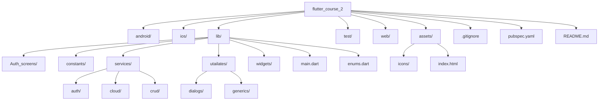

# 📝 MyNotes - Flutter Course Project

<div align="center">
  
  
  
</div>

## 📋 Project Overview
MyNotes is a modern note-taking application built with Flutter that allows users to create, edit, and sync notes across devices. It features Firebase authentication, real-time cloud synchronization using Cloud Firestore, and a clean, intuitive UI.

---

### ✨ Key Features
- 🔒 **Secure Authentication**: Login/register with email verification
- ☁️ **Cloud Sync**: Notes automatically sync across devices
- ✏️ **Rich Text Editing**: Create and format notes with ease
- 📱 **Responsive Design**: Works on mobile, web, and desktop
- 🤝 **Sharing**: Share notes with other users

### 👥 Target Audience
- 🎓 Students taking lecture notes
- 💼 Professionals organizing tasks
- 🌍 Anyone needing a simple, cross-platform note solution

---

## 🗂 Project Structure


---

## 📦 Critical Package Implementations

### Dependencies (pubspec.yaml)
```yaml
dependencies:
  flutter:
    sdk: flutter
  firebase_core: ^3.6.0       # Firebase core
  firebase_auth: ^5.3.1        # Authentication
  cloud_firestore: ^5.6.9      # Cloud database
  fluttertoast: ^8.2.1         # Toast notifications
  share_plus: ^11.0.0          # Note sharing
  sqflite: ^2.4.2              # Local storage
```

### Main Application Initialization (lib/main.dart)
```dart
import 'package:firebase_core/firebase_core.dart';
import 'package:flutter/material.dart';

void main() async {
  WidgetsFlutterBinding.ensureInitialized();
  await Firebase.initializeApp();  // Initialize Firebase
  runApp(const MyApp());
}

class MyApp extends StatelessWidget {
  const MyApp({super.key});

  @override
  Widget build(BuildContext context) {
    return MaterialApp(
      title: 'MyNotes',
      routes: {
        loginRoute: (context) => const LoginScreen(),
        registerRoute: (context) => const RegisterScreen(),
        HomePageRoute: (context) => HomeScreen(),
        noteView: (context) => const CreateUpdateNoteView(),
      },
      home: const AccountAnalyze(), // Auth state handler
    );
  }
}
```

---

## 🚀 Getting Started
This project is a starting point for a Flutter application. Here's how to get started:

1. **Install dependencies**  
   ```bash
   flutter pub get
   ```

2. **Run the application**  
   ```bash
   flutter run
   ```

3. **Build for production**  
   ```bash
   flutter build apk --release  # For Android
   flutter build ios --release   # For iOS
   ```

### 📚 Learning Resources
- [Lab: Write your first Flutter app](https://docs.flutter.dev/get-started/codelab)
- [Cookbook: Useful Flutter samples](https://docs.flutter.dev/cookbook)
- [Flutter documentation](https://docs.flutter.dev/)
- [Firebase documentation](https://firebase.google.com/docs/flutter/setup)

## Contact With Me 
[My Email]: [kerollosmelad94@gmail.com]